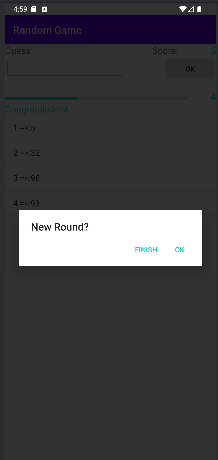
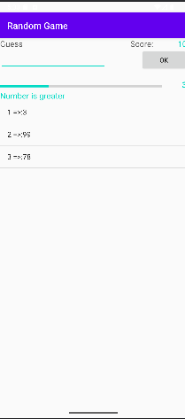
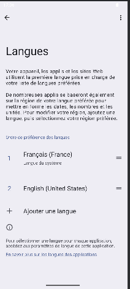

# 🎲 Jeu de Devinette

## Description
Un jeu de devinettes de nombres aléatoires. L'application :

Génère un nombre secret entre 1 et 100
Guide l'utilisateur avec des indices comme "Trop petit" ou "Trop grand"
Suit le nombre de tentatives à l'aide d'une ProgressBar
Affiche un score et sauvegarde l'historique des tentatives
Le changement de langue dépend de la langue par défaut de l'utilisateur.

Chaque partie augmente le score si l'utilisateur gagne dans les tentatives autorisées.

## Demo

